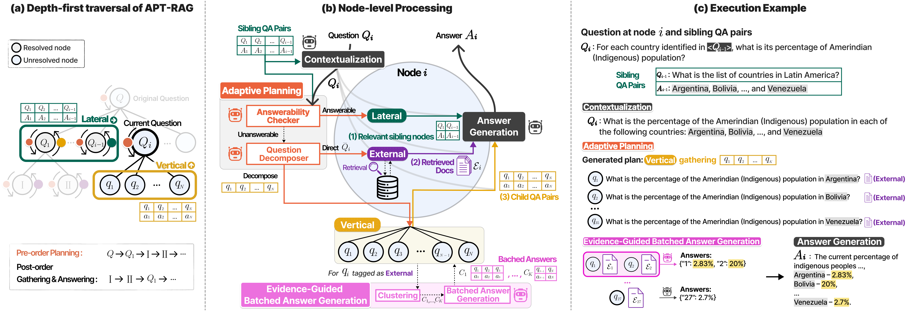

# APT-RAG: Adaptive Planning and Topology-aware Evidence Gathering for Evidence-Intensive QA

This repository contains the implementation of APT-RAG, a tree-based RAG framework for evidence-intensive QA via adaptive planning and topology-aware evidence gathering.

## Overview 

Evidence-intensive QA requires synthesizing information scattered across dozens or even hundreds of documents, exposing two fundamental limitations of existing structured RAG methods: **structural rigidity**, which prevents dynamic reasoning expansion, and **topology-ignorant evidence gathering**, which fails to integrate evidence across different reasoning nodes.
 
To address these limitations, we propose **APT-RAG**, an **A**daptive **P**lanning and **T**opology-aware evidence gathering RAG framework. APT-RAG recursively constructs a reasoning tree in a depth-first manner and resolves each node through the following four-step procedure:
 
- **Contextualization:** Resolves references to preceding sibling answers to produce a self-contained sub-question.
- **Adaptive Planning:** Determines the evidence gathering strategy—reusing sibling QA pairs (lateral), directly retrieving from the corpus (external), or decomposing into sub-questions (vertical).
- **Topology-aware Evidence Gathering:** Gathers evidence along the reasoning topology through lateral, external, or vertical strategies.
- **Answer Generation:** Generates a sub-answer that can subsequently serve as evidence for sibling or parent nodes.
APT-RAG further introduces **Evidence-Guided Batched Answer Generation**, which clusters sibling sub-questions sharing overlapping retrieved evidence and answers them jointly, substantially reducing LLM calls and inference latency.
 
<p align="center">
  
</p>
 


## Requirements

```
pip install -r requirements.txt
```

If you run an OpenAI-compatible evaluation model, set the API key through the environment:

```bash
export OPENAI_API_KEY="your-api-key"
```

## Datasets

- In our paper, we use two evidence-intensive QA benchmarks that require synthesizing information distributed across dozens to hundreds of documents.
- [**MoNaCo**](https://arxiv.org/pdf/2508.11133): A benchmark of complex information-seeking questions requiring synthesis across 43.3 documents on average. 
- [**QAMPARI**](https://arxiv.org/pdf/2205.12665): A multi-answer open-domain QA benchmark where answers are distributed across multiple passages, requiring aggregation over 13.0 documents on average. 

Benchmark files, retrieval corpora, vector indices, and generated outputs are not included in this repository because they may contain benchmark queries, gold answers, retrieved passages, or large artifacts. The code expects these files to be placed under the paths documented below.

## APT-RAG

Entry point: `src/baselines/apt-rag/main.py`

Before running APT-RAG, start the retrieval server for your dataset (see [Retrieval Server](#retrieval-server)) and ensure the benchmark queries and corpus are available under `data/`.

### **Configurable Parameters**

**Model & dataset**

- `--llm-type` : HuggingFace model name or path used for planning, rewriting, clustering, and answer generation. Default: `Qwen/Qwen3-30B-A3B-Instruct-2507`.
- `--dataset-name` : Benchmark to run. `monaco` or `qampari`.
- `--sample` : Query subset to evaluate. `full` (default) or `sample_300`.
- `--answer-dir` : Output directory for predictions and execution traces. Required.

**Retrieval**

- `--corpus-path` : Path to the retrieval corpus JSONL. Required.
- `--api-server-url` : URL of the dense retrieval API server (used when `--use-api` is set). The batch scripts use `http://localhost:8007` for MoNaCo and `http://localhost:8008` for QAMPARI.
- `--use-api` / `--no-use-api` : Query the retrieval server (`True`, default) or load a local index (`False`).
- `--retrieval-type` : Retrieval backend. `dense` (default) or `bm25`.
- `--top-k` : Number of passages retrieved per query. Default: `20`.
- `--final-top-k` : Number of passages kept after post-processing. Default: `10`.
- `--expand` / `--no-expand` : Expand retrieved chunks to full sections using the corpus inverted index. Enabled for MoNaCo, disabled for QAMPARI in `scripts/gen_all_baselines_ans.sh`.
- `--post-processing` / `--no-post-processing` : Apply retrieval post-processing. Default: disabled.

**Parallel execution (environment variables)**

- `APT_RAG_NUM_SHARDS` : Total number of parallel workers (default: `1`).
- `APT_RAG_SHARD_INDEX` : Zero-based shard index for the current worker (default: `0`). Examples are partitioned by `ex_num`.

**Fixed in code (not exposed as CLI flags)**

- Maximum reasoning depth: `4`.
- Context window for evidence clustering: `50,000` tokens for `Qwen/Qwen3-30B-A3B-Instruct-2507`, `150,000` otherwise.

### Running the APT-RAG Framework

APT-RAG recursively builds a reasoning tree and writes, for each example:

- `ex_{id}_answer.json` — final answer and tree structure
- `ex_{id}_retrieved.json` — retrieved passages
- `execution_traces/ex_{id}.json` — full execution trace for evaluation

**Run via batch script (recommended)**

`scripts/gen_all_baselines_ans.sh` runs APT-RAG together with other baselines. Filter to APT-RAG only:

```bash
# MoNaCo + QAMPARI, both LLM sizes
METHOD_FILTER=apt-rag bash scripts/gen_all_baselines_ans.sh

# Single dataset / model
DATASET_FILTER=monaco MODEL_FILTER=Qwen3-30B-A3B-Instruct-2507 METHOD_FILTER=apt-rag \
  bash scripts/gen_all_baselines_ans.sh

# 300-example subset
SAMPLE=sample_300 METHOD_FILTER=apt-rag bash scripts/gen_all_baselines_ans.sh
```

Results are saved under `results/{dataset}/apt-rag/answer/{model_name}/`.

**Direct invocation**

```bash
export PYTHONPATH="src/baselines:src/evaluation:${PYTHONPATH:-}"
export CUDA_VISIBLE_DEVICES=3

# MoNaCo
python src/baselines/apt-rag/main.py \
  --llm-type Qwen/Qwen3-30B-A3B-Instruct-2507 \
  --dataset-name monaco \
  --sample full \
  --answer-dir results/monaco/apt-rag/answer/Qwen3-30B-A3B-Instruct-2507 \
  --corpus-path data/artifacts/corpus/monaco/corpus_1M.jsonl \
  --api-server-url http://localhost:8007 \
  --use-api \
  --expand \
  --retrieval-type dense \
  --top-k 20 \
  --final-top-k 10 \
  --no-post-processing

# QAMPARI
python src/baselines/apt-rag/main.py \
  --llm-type Qwen/Qwen3-4B-Instruct-2507 \
  --dataset-name qampari \
  --sample full \
  --answer-dir results/qampari/apt-rag/answer/Qwen3-4B-Instruct-2507 \
  --corpus-path data/artifacts/corpus/qampari/corpus.jsonl \
  --api-server-url http://localhost:8008 \
  --use-api \
  --no-expand \
  --retrieval-type dense \
  --top-k 20 \
  --final-top-k 10 \
  --no-post-processing
```

**Parallel sharding across GPUs**

```bash
APT_RAG_NUM_SHARDS=4 APT_RAG_SHARD_INDEX=0 CUDA_VISIBLE_DEVICES=0 \
  python src/baselines/apt-rag/main.py ...  # worker 0

APT_RAG_NUM_SHARDS=4 APT_RAG_SHARD_INDEX=1 CUDA_VISIBLE_DEVICES=1 \
  python src/baselines/apt-rag/main.py ...  # worker 1
```

Each worker skips examples whose `execution_traces/ex_{id}.json` already exists, so shards can be resumed safely.


## Corpus and Index Construction

Retrieval corpora and vector indices live under `data/artifacts/`. All downstream scripts read from these fixed paths:

| Dataset  | Corpus path | Index path |
|----------|-------------|------------|
| MoNaCo   | `data/artifacts/corpus/monaco/corpus_1M.jsonl` | `data/artifacts/vectorDB/monaco/` |
| QAMPARI  | `data/artifacts/corpus/qampari/corpus.jsonl` | `data/artifacts/vectorDB/qampari/` |

### Corpus

**MoNaCo**

Scripts: `src/artifacts_construction/corpus/monaco/`

1. **Parse** — `wikidump_parser.py` converts a Wikipedia `.xml.bz2` dump into JSONL.
2. **Chunk** — `corpus_chunker.py` splits passages into chunks (default: 512 tiktoken tokens).
3. **Sample** — `corpus_sampler.py` retains all gold passages (from MoNaCo execution traces) and samples 1M non-gold document groups.

Gold provenance traces must be placed at:
`data/benchmarks/monaco/execution_traces/dataset_ex_*.json`

```bash
# Step 1: parse dump (see wikidump_parser.py --help for multi-worker usage)
python src/artifacts_construction/corpus/monaco/wikidump_parser.py \
  --input /path/to/enwiki.xml.bz2 \
  --output-dir /tmp/monaco_corpus 0 1 --merge

# Step 2: chunk
python src/artifacts_construction/corpus/monaco/corpus_chunker.py \
  --input /tmp/monaco_corpus/corpus.jsonl \
  --output /tmp/monaco_corpus/corpus_chunked.jsonl

# Step 3: sample → final corpus
python src/artifacts_construction/corpus/monaco/corpus_sampler.py \
  --corpus /tmp/monaco_corpus/corpus_chunked.jsonl \
  --trace-dir data/benchmarks/monaco/execution_traces \
  --output data/artifacts/corpus/monaco/corpus_1M.jsonl
```

**QAMPARI**

Download the QAMPARI corpus from the [official website](https://samsam3232.github.io/qampari/) and place it at:

```
data/artifacts/corpus/qampari/corpus.jsonl
```

### Vector Index

Both datasets use `Qwen/Qwen3-Embedding-0.6B` and build an HNSW index (`hnsw_sq8/hnsw.index` + `index.pkl`). Index scripts launch `src/artifacts_construction/vectorDB/indexer/corpus_indexer.py` as a background job via `systemd-run` (requires a Linux user systemd session).

```bash
# MoNaCo
bash scripts/run_index_monaco.sh <gpu_id>

# QAMPARI
bash scripts/run_index_qampari.sh <gpu_id>
```

## Retrieval Server

After the index is built, start a FastAPI retrieval server. Baseline scripts query these servers at runtime.

| Dataset  | Server script | Default port |
|----------|---------------|--------------|
| MoNaCo   | `scripts/run_server_monaco.sh` | `8007` |
| QAMPARI  | `scripts/run_server_qampari.sh` | `8008` |

```bash
# MoNaCo
bash scripts/run_server_monaco.sh <gpu_id>

# QAMPARI
bash scripts/run_server_qampari.sh <gpu_id>
```

## Baselines

The repository includes the following inference baselines under `src/baselines/`:

| Method | Entry point |
|--------|-------------|
| LLM-only | `src/baselines/llm_only/LLM_only.py` |
| Naive RAG | `src/baselines/naive-rag/LLM_DPR.py` |
| Plan-RAG | `src/baselines/plan-rag/main.py` |
| Tree-of-Question | `src/baselines/tree-of-question/main.py` |
| RT-RAG | `src/baselines/rt-rag/main.py` |
| Logic-RAG | `src/baselines/logic-rag/main.py` |
| APT-RAG | `src/baselines/apt-rag/main.py` |

Run all methods through the unified script:

```bash
bash scripts/gen_all_baselines_ans.sh
```

Useful filters:

```bash
DATASET_FILTER=monaco METHOD_FILTER=apt-rag bash scripts/gen_all_baselines_ans.sh
MODEL_FILTER=Qwen3-4B-Instruct-2507 METHOD_FILTER=naive-rag bash scripts/gen_all_baselines_ans.sh
DRY_RUN=1 bash scripts/gen_all_baselines_ans.sh
```

## Evaluation

Answer, retrieval, and cost evaluation scripts are grouped under `src/evaluation/` and wrapped by shell scripts in `scripts/`.

```bash
# Answer quality
bash scripts/eval_all_baselines_ans.sh

# Retrieval metrics
bash scripts/eval_all_baselines_ret.sh

# Cost and trace statistics
bash scripts/eval_all_baselines_cost.sh
```

The scripts skip missing inputs and can be filtered with `DATASET_FILTER`, `MODEL_FILTER`, and `METHOD_FILTER` in the same way as generation. Use `DRY_RUN=1` to print commands without writing new outputs.

Generated answers, execution traces, detailed LLM judge calls, retrieval metrics, and cost metrics are written under `results/`. These files are intentionally excluded from version control because they may contain benchmark questions, gold answers, retrieved evidence, and model outputs.

## Repository Contents

This code release is intended to include:

- Source code for APT-RAG and baseline inference under `src/baselines/`.
- Evaluation code under `src/evaluation/`.
- Corpus/index construction and retrieval server code under `src/artifacts_construction/`.
- Shell scripts under `scripts/`.
- Dependency metadata such as `requirements.txt`.

This repository is not intended to include:

- Benchmark question files or gold annotations under `data/benchmarks/`.
- Retrieval corpora under `data/artifacts/corpus/`.
- Vector database files under `data/artifacts/vectorDB/`.
- Generated answers, execution traces, evaluation logs, or metric outputs under `results/`.
- Local credentials, API keys, cache files, or model checkpoints.